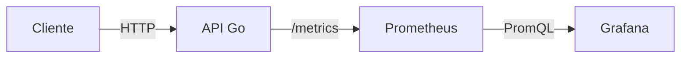

# Go API Monitoring


Este repositório contém um projeto de estudo focado em **observabilidade e monitoramento** de uma API escrita em **Go**, utilizando **Prometheus** para coleta de métricas e **Grafana** para visualização.

O objetivo é aprender, de forma prática, como instrumentar uma aplicação Go, expor métricas, consultá-las com PromQL e criar dashboards no Grafana.

---

## 🛠️ Tecnologias utilizadas

* **Go** – API HTTP
* **Prometheus** – Coleta e consulta de métricas
* **Grafana** – Visualização e dashboards
* **Docker & Docker Compose** – Ambiente reproduzível

---

## 📐 Arquitetura



```
Cliente
   |
   v
API Go  --->  /metrics  --->  Prometheus  --->  Grafana
```

---

## 🚀 Como executar o projeto

### Pré-requisitos

* Go 1.22+
* Docker
* Docker Compose

### Subindo o ambiente

```bash
docker-compose up --build
```

Serviços disponíveis:

* API Go: [http://localhost:8080](http://localhost:8080)
* Métricas (Prometheus): [http://localhost:9090](http://localhost:9090)
* Grafana: [http://localhost:3000](http://localhost:3000)

  * Usuário: `admin`
  * Senha: `admin`

---

## 🔍 Endpoints da API

* `GET /health` – Health check da aplicação
* `GET /metrics` – Métricas expostas para o Prometheus

---

## 📊 Métricas implementadas

Atualmente, a API expõe métricas básicas, como:

* Total de requisições HTTP (`http_requests_total`)
* Requisições por segundo (via `rate()` no Grafana)

Exemplo de query PromQL:

```promql
rate(http_requests_total[1m])
```

---

## 📈 Dashboard no Grafana

O dashboard **Go API – Overview** contém gráficos para:

* Requests por segundo (RPS)
* Visão geral de tráfego da API

> O dashboard será expandido conforme novas métricas forem adicionadas (latência, erros, etc.).

---

## 🧪 Gerando tráfego de teste

Para gerar requisições continuamente:

```bash
while true; do curl http://localhost:8080/health; sleep 1; done
```

---

## 🧩 Próximos passos (roadmap)

* [ ] Métricas de latência (Histogram)
* [ ] Métricas de erro (4xx / 5xx)
* [ ] Middleware de métricas
* [ ] Alertas no Prometheus / Grafana
* [ ] Organização avançada do projeto

---

## 📚 Objetivo educacional

Este projeto tem foco **educacional** e serve como base para aprender:

* Boas práticas de métricas
* PromQL
* Observabilidade em aplicações Go
* Integração Prometheus + Grafana

---

## 📄 Licença

Este projeto é livre para estudo e uso educacional.
